# docker-lab-8-scout
Example usage of Docker Scout tool for inspecting vulnerabilities of images.

## Table of Contents

- [Requirements](#requirements)
- [Image Building](#image-building)
- [Diagnostics](#diagnostics)
- [Fixing The Image](#fixing-the-image)
- [Repository And Scouting](#repository-and-scouting)

## Requirements

For Linux and Windows systems Docker or Docker Desktop must be installed and running.

For Windows systems WSL must be installed.

Create a repository on [hub.docker.com](https://hub.docker.com/) using your account.

Enroll your account:

```cmd
docker scout enroll eyelor
```

Result:

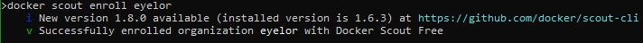

Enroll your repository:

```cmd
docker scout repo enable --org eyelor eyelor/labx
```

Result:

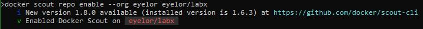

## Image Building

Example for Windows:

Run the command below to build an image. Change the '-t' parameter value to your desired image tag, repository and account name.

```cmd
docker buildx build -q -f Dockerfile_classic -t eyelor/labx:lab8-classic --sbom=true --provenance=mode=max --push .
```

Result:

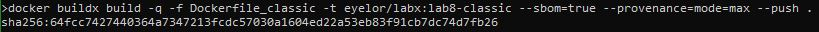

## Diagnostics

Check the vulnerabilities of the image.

```cmd
docker cves --platform linux/amd64 --only-severity critical,high eyelor/labx:lab8-classic
```

Results:

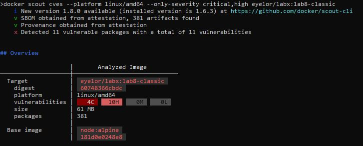
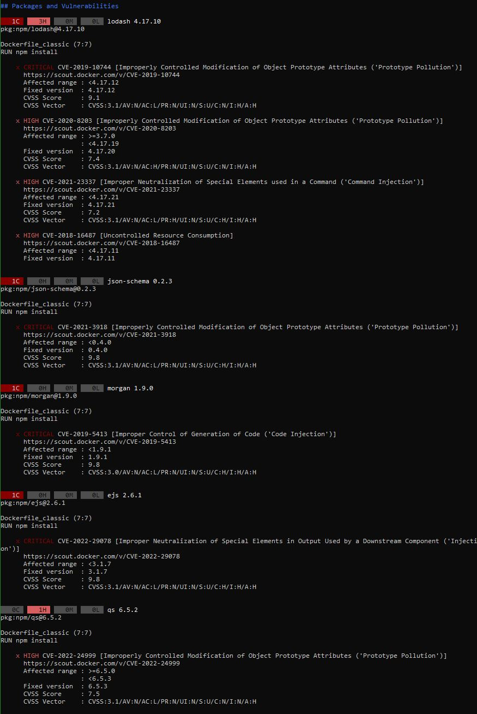
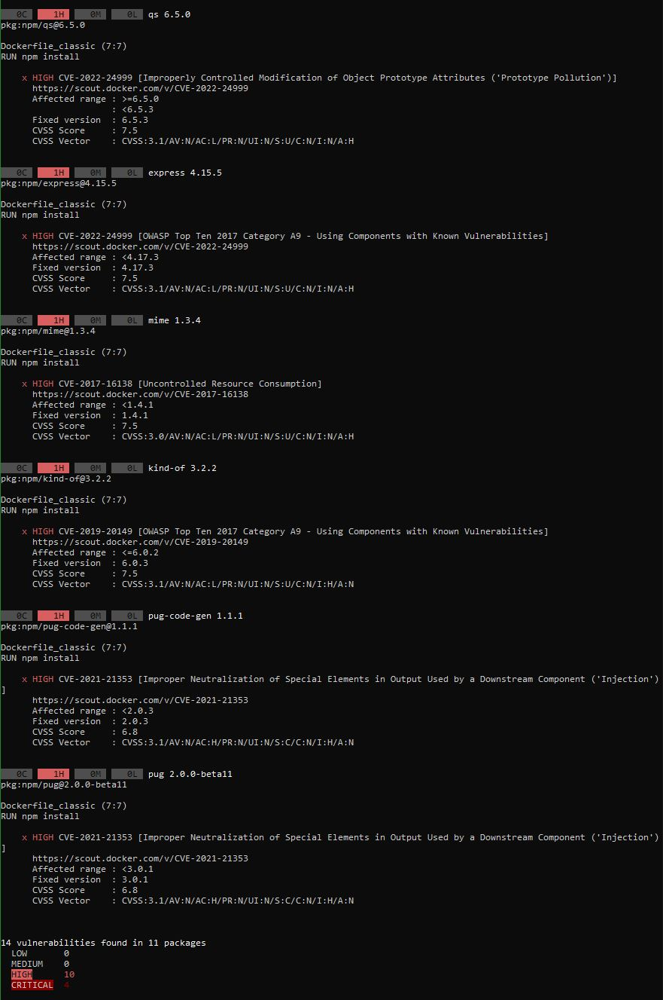

Vulnerabilities are due to unsupported versions of the packages in the package.json project file.

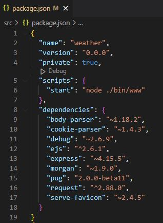

## Fixing The Image

To fix critical and high vulnerabilities the package.json file must be editted.

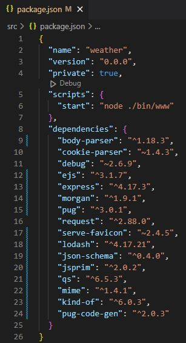

After that build and scout the image again to see the results.

Building:

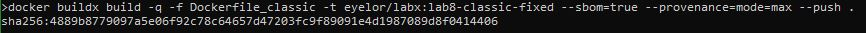

Scouting:

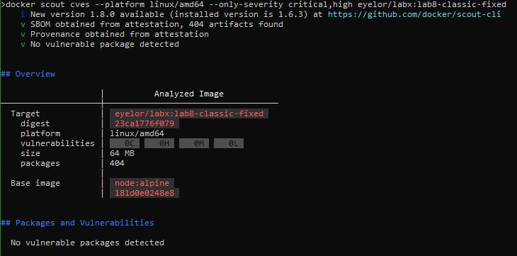

After the changes there are no critical and high vulnerabilities.

## Repository And Scouting

Created images are accessible on the [hub.docker.com](https://hub.docker.com/) service.

If the repository has Scout enabled there are visual summaries of image vulnerabilities.

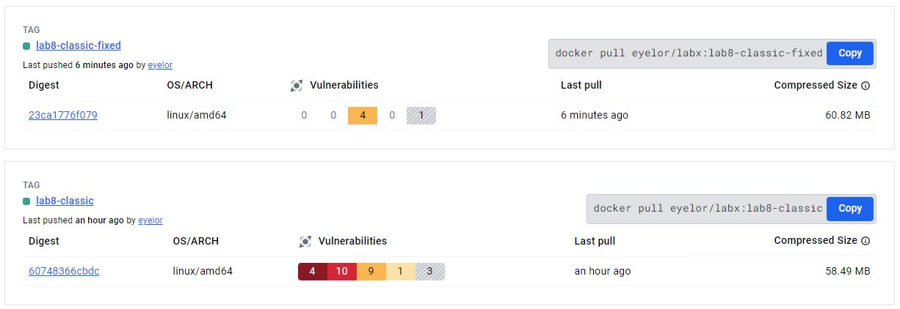

Link to used images: [hub.docker.com/r/eyelor/labx/tags](https://hub.docker.com/r/eyelor/labx/tags)

